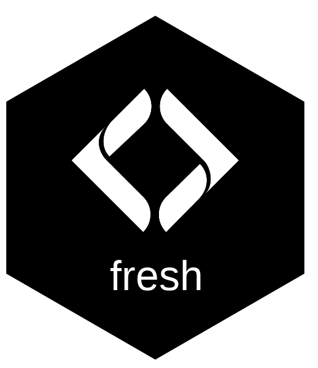

# fresh 

> Freshwater Referenced Spatial Hydrology

A composable stream network modelling engine. Query and extract stream networks, classify habitat by gradient and channel width, segment networks at barriers and break points, aggregate features upstream or downstream, and run multi-species habitat modelling with parallel workers. Supports custom model outputs and attribute joining — channel width, mean annual discharge, precipitation, or any scalar value. Currently running on BC's Freshwater Atlas, designed to model fish habitat, connectivity, water temperature, channel morphology, and custom attributes for any species or question on any stream network.

## Installation

```r
pak::pak("NewGraphEnvironment/fresh")
```

## Prerequisites

PostgreSQL with [fwapg](https://github.com/smnorris/fwapg) loaded. A local Docker setup is included:

```bash
cd docker
docker compose up -d db
docker compose run --rm loader
```

See `docker/README.md` for details. Connection via `frs_db_conn()` or direct `DBI::dbConnect()`.

## Example

Segment a stream network at gradient barriers and classify habitat for multiple species:

```r
library(fresh)

conn <- DBI::dbConnect(RPostgres::Postgres(),
  host = "localhost", port = 5432,
  dbname = "fwapg", user = "postgres", password = "postgres")

# 1. Generate gradient access barriers
frs_break_find(conn, "working.tmp",
  attribute = "gradient", threshold = 0.15,
  to = "working.barriers_15")

# 2. Segment network at barriers + falls
frs_network_segment(conn, aoi = "BULK",
  to = "fresh.streams",
  break_sources = list(
    list(table = "working.barriers_15", label = "gradient_15"),
    list(table = "working.falls", label = "blocked")))

# 3. Classify habitat per species
frs_habitat_classify(conn,
  table = "fresh.streams",
  to = "fresh.streams_habitat",
  species = c("CO", "BT", "ST"))
```

Or use the orchestrator for multi-WSG runs with any AOI:

```r
# Province-wide with parallel workers
frs_habitat(conn, c("BULK", "MORR", "ZYMO"),
  to_streams = "fresh.streams",
  to_habitat = "fresh.streams_habitat",
  workers = 4, password = "postgres",
  break_sources = list(
    list(table = "working.falls", label = "blocked")))

# Custom AOI — sub-basin, territory, or any spatial extent
frs_habitat(conn,
  aoi = "wscode_ltree <@ '100.190442'::ltree",
  species = c("BT", "CO"),
  label = "richfield",
  to_streams = "fresh.streams",
  to_habitat = "fresh.streams_habitat")
```

See the [pkgdown site](https://newgraphenvironment.github.io/fresh/) for vignettes and function reference.

## Ecosystem

| Package | Role |
|---------|------|
| **fresh** | Stream network modelling engine (this package) |
| [link](https://github.com/NewGraphEnvironment/link) | Crossing connectivity interpretation — scoring, overrides, prioritization |
| [flooded](https://github.com/NewGraphEnvironment/flooded) | Delineate floodplain extents from DEMs and stream networks |
| [drift](https://github.com/NewGraphEnvironment/drift) | Track land cover change within floodplains over time |

Pipeline: fresh (network + habitat) &rarr; flooded (floodplains) &rarr; drift (land cover change)

## License

MIT
