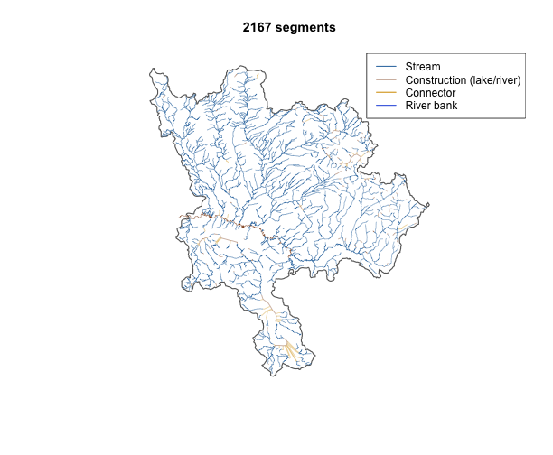
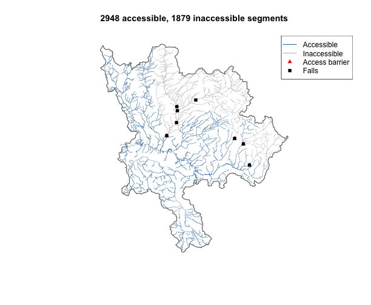
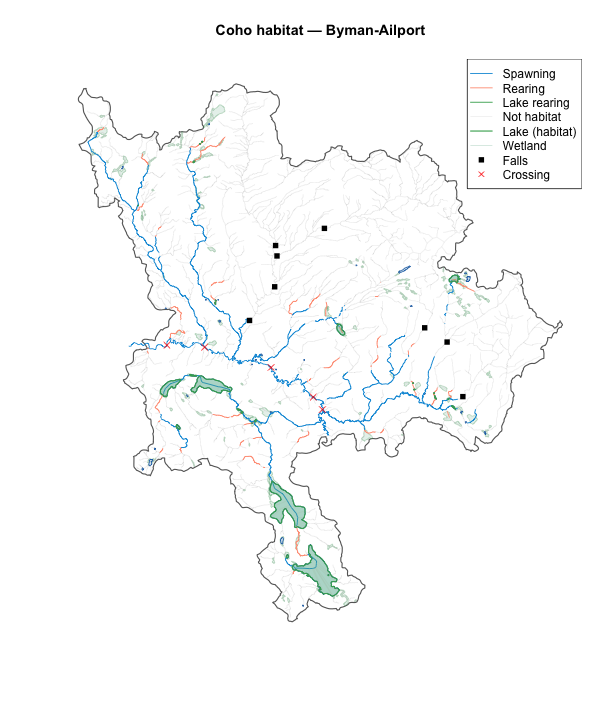
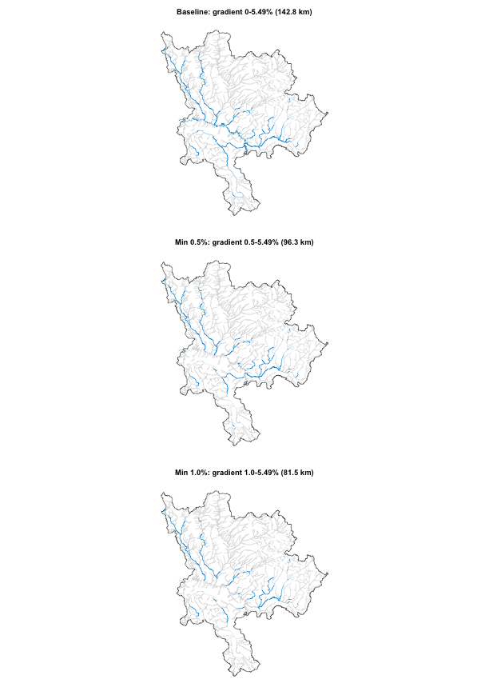

We classify coho salmon habitat on a subbasin of the Neexdzii Kwa (Upper
Bulkley River) in the traditional territory of the Wet'suwet'en. The
subbasin runs from Byman Creek (downstream) to Ailport Creek (upstream).

The pipeline extracts the stream network to a working table on PostgreSQL,
enriches it with channel width, identifies access barriers (gradient and
falls), classifies spawning and rearing habitat within accessible reaches,
and aggregates habitat lengths upstream of crossings. Everything stays on
the database until the final read — R orchestrates SQL, PostgreSQL handles
the geometry.

## Parameters

Habitat thresholds come from two bundled CSVs. The first mirrors the
[bcfishpass defaults](https://github.com/smnorris/bcfishpass/tree/main/parameters/example_newgraph)
— spawning and rearing gradient, channel width, and MAD thresholds per
species. The second holds fresh-specific parameters: access gradient
thresholds (hardcoded per species group in bcfishpass
[`model_access_*.sql`](https://github.com/smnorris/bcfishpass/tree/main/model/01_access/sql))
and minimum spawning gradients. bcfishpass uses a minimum of 0% — salmonids
don't spawn in flat water, so we default to 0.5%.

## Study area

The study area is defined by a blue line key and two downstream route
measures. `frs_watershed_at_measure()` delineates the watershed polygon
between them — network subtraction, no spatial clipping.

## Extract and enrich

`frs_network(to=)` writes the stream network to a working table on the
database. `frs_col_join()` adds channel width from the FWA lookup table.
`frs_col_generate()` converts gradient to a PostgreSQL generated column so
it auto-recomputes when geometry is split by breaks.

## Access barriers

Two sources: gradient barriers and falls. `frs_break_find()` with the
attribute mode samples slope at 100m intervals and identifies locations
where gradient exceeds the species threshold (15% for coho).
`frs_break_find()` with the table mode pulls barrier falls from the
database. Both write to the same breaks table. `frs_break_apply()` splits
the stream geometry at those locations and `frs_classify()` labels
everything upstream of a barrier as inaccessible.

## Habitat classification

Only accessible segments get habitat labels. Spawning requires gradient
0–5.49% and channel width >= 2m. Rearing requires gradient 0–5.49% and
channel width >= 1.5m. Lake rearing uses channel width on lake-connected
segments — recovering habitat that bcfishpass scores as zero.

## Scenario comparison

The baseline uses bcfishpass defaults (spawn gradient min = 0%). We then
classify with minimum gradients of 0.5% and 1.0% to show the effect of
excluding low-gradient reaches.


``` r
library(fresh)
library(sf)
#> Linking to GEOS 3.13.0, GDAL 3.8.5, PROJ 9.5.1; sf_use_s2() is TRUE

sf_use_s2(FALSE)
#> Spherical geometry (s2) switched off

conn <- frs_db_conn()

# Study area: Byman Creek to Ailport Creek on the Neexdzii Kwa mainstem
blk <- 360873822
drm_byman <- 208877
drm_ailport <- 233564

# Habitat thresholds from bcfishpass defaults
# https://github.com/smnorris/bcfishpass/tree/main/parameters/example_newgraph
params_all <- frs_params(csv = system.file("extdata",
  "parameters_habitat_thresholds.csv", package = "fresh"))
params_co <- params_all$CO

# Access gradient and spawn gradient min from fresh parameters
# Access thresholds sourced from bcfishpass model_access_ch_cm_co_pk_sk.sql:16
# Spawn gradient min is our addition — bcfishpass defaults to 0
params_fresh <- read.csv(system.file("extdata",
  "parameters_fresh.csv", package = "fresh"))
co_fresh <- params_fresh[params_fresh$species_code == "CO", ]

# Watershed polygon for the study area
aoi <- frs_watershed_at_measure(conn, blk, drm_byman,
  upstream_measure = drm_ailport)

# Extract stream network to working table, enrich with channel width,
# convert gradient to generated column
conn |>
  frs_network(blk, drm_byman, upstream_measure = drm_ailport,
    to = "working.byman_habitat") |>
  frs_col_join("working.byman_habitat",
    from = "fwa_stream_networks_channel_width",
    cols = c("channel_width", "channel_width_source"),
    by = "linear_feature_id") |>
  frs_col_generate("working.byman_habitat")
#> NOTICE:  table "byman_habitat" does not exist, skipping

# Snapshot before breaks
before <- frs_db_query(conn,
  "SELECT gradient, channel_width, edge_type, waterbody_key, geom
   FROM working.byman_habitat")

# Access barriers: gradient >= 15% for coho
frs_break_find(conn, "working.byman_habitat",
  attribute = "gradient", threshold = co_fresh$access_gradient_max,
  to = "working.breaks_access")
#> NOTICE:  table "breaks_access" does not exist, skipping

# Access barriers: falls with barrier_ind = TRUE, scoped to study area
frs_break_find(conn, "working.byman_habitat",
  points_table = "bcfishpass.falls_vw",
  where = "barrier_ind = TRUE",
  aoi = aoi,
  to = "working.breaks_access", append = TRUE)

# Split geometry and classify accessible
frs_break_apply(conn, "working.byman_habitat",
  breaks = "working.breaks_access")

conn |>
  frs_classify("working.byman_habitat", label = "accessible",
    breaks = "working.breaks_access")

# Access break points with geometry for plotting
breaks_access_sf <- frs_db_query(conn,
  "SELECT b.blue_line_key, b.downstream_route_measure,
     ST_Force2D((ST_Dump(ST_LocateAlong(s.geom, b.downstream_route_measure))).geom)::geometry(Point, 3005) AS geom
   FROM working.breaks_access b
   JOIN whse_basemapping.fwa_stream_networks_sp s
     ON b.blue_line_key = s.blue_line_key
     AND b.downstream_route_measure >= s.downstream_route_measure
     AND b.downstream_route_measure < s.upstream_route_measure")

# Habitat gradient breaks at 5.49%
conn |>
  frs_break("working.byman_habitat",
    attribute = "gradient",
    threshold = params_co$spawn_gradient_max,
    to = "working.breaks_habitat")
#> NOTICE:  table "breaks_habitat" does not exist, skipping

# Classify habitat within accessible reaches
# Baseline: spawn gradient 0-5.49% (bcfishpass default, no minimum)
conn |>
  frs_classify("working.byman_habitat", label = "co_spawning",
    ranges = list(gradient = c(0, params_co$spawn_gradient_max),
                  channel_width = params_co$ranges$spawn$channel_width),
    where = "accessible IS TRUE") |>
  frs_classify("working.byman_habitat", label = "co_rearing",
    ranges = params_co$ranges$rear[c("gradient", "channel_width")],
    where = "accessible IS TRUE") |>
  frs_classify("working.byman_habitat", label = "co_lake_rearing",
    ranges = list(channel_width = params_co$ranges$rear$channel_width),
    where = "accessible IS TRUE AND waterbody_key IN (SELECT waterbody_key FROM whse_basemapping.fwa_lakes_poly)")

classified <- frs_db_query(conn,
  "SELECT linear_feature_id, blue_line_key, edge_type, gradient,
          channel_width, waterbody_key, accessible, co_spawning,
          co_rearing, co_lake_rearing, geom
   FROM working.byman_habitat")

# Waterbodies on accessible habitat, clipped to study area
waterbodies <- frs_network(conn, blk, drm_byman,
  upstream_measure = drm_ailport, clip = aoi,
  tables = list(
    lakes = list(table = "whse_basemapping.fwa_lakes_poly",
      from = "working.byman_habitat",
      extra_where = "co_rearing IS TRUE OR co_lake_rearing IS TRUE"),
    wetlands = list(table = "whse_basemapping.fwa_wetlands_poly",
      from = "working.byman_habitat",
      extra_where = "co_rearing IS TRUE")))

# All accessible waterbodies for background
all_wb <- frs_network(conn, blk, drm_byman,
  upstream_measure = drm_ailport, clip = aoi,
  tables = list(
    lakes = list(table = "whse_basemapping.fwa_lakes_poly",
      from = "working.byman_habitat", extra_where = "accessible IS TRUE"),
    wetlands = list(table = "whse_basemapping.fwa_wetlands_poly",
      from = "working.byman_habitat", extra_where = "accessible IS TRUE")))

# Aggregate habitat upstream of crossings + subbasin outlet
DBI::dbExecute(conn, "DROP TABLE IF EXISTS working.byman_crossings")
#> NOTICE:  table "byman_crossings" does not exist, skipping
#> [1] 0
DBI::dbExecute(conn, sprintf(
  "CREATE TABLE working.byman_crossings AS
   SELECT aggregated_crossings_id AS id, blue_line_key, downstream_route_measure
   FROM bcfishpass.crossings
   WHERE blue_line_key = %s
     AND downstream_route_measure >= %s AND downstream_route_measure <= %s
   UNION ALL
   SELECT 'subbasin_total' AS id, %s AS blue_line_key, %s AS downstream_route_measure",
  blk, drm_byman, drm_ailport, blk, drm_byman))
#> [1] 6

crossings <- frs_db_query(conn,
  "SELECT aggregated_crossings_id, blue_line_key,
          downstream_route_measure, barrier_status, geom
   FROM bcfishpass.crossings
   WHERE blue_line_key = 360873822
     AND downstream_route_measure >= 208877 AND downstream_route_measure <= 233564")

agg <- frs_aggregate(conn,
  points = "working.byman_crossings",
  features = "working.byman_habitat",
  id_col = c("id", "blue_line_key", "downstream_route_measure"),
  metrics = c(
    total_km = "ROUND(SUM(ST_Length(f.geom))::numeric / 1000, 1)",
    accessible_km = "ROUND(SUM(CASE WHEN f.accessible IS TRUE THEN ST_Length(f.geom) ELSE 0 END)::numeric / 1000, 1)",
    spawning_km = "ROUND(SUM(CASE WHEN f.co_spawning IS TRUE THEN ST_Length(f.geom) ELSE 0 END)::numeric / 1000, 1)",
    rearing_km = "ROUND(SUM(CASE WHEN f.co_rearing IS TRUE THEN ST_Length(f.geom) ELSE 0 END)::numeric / 1000, 1)",
    lake_rearing_km = "ROUND(SUM(CASE WHEN f.co_lake_rearing IS TRUE THEN ST_Length(f.geom) ELSE 0 END)::numeric / 1000, 1)"),
  direction = "upstream")

# Scenario comparison: baseline (0%), 0.5%, 1.0% spawn gradient min
spawn_max <- params_co$spawn_gradient_max
cw_min <- params_co$ranges$spawn$channel_width[1]

# Scenario: spawn gradient >= 0.5%
conn |>
  frs_classify("working.byman_habitat", label = "co_spawn_05",
    ranges = list(gradient = c(0.005, spawn_max), channel_width = c(cw_min, 9999)),
    where = "accessible IS TRUE")

# Scenario: spawn gradient >= 1.0%
conn |>
  frs_classify("working.byman_habitat", label = "co_spawn_10",
    ranges = list(gradient = c(0.01, spawn_max), channel_width = c(cw_min, 9999)),
    where = "accessible IS TRUE")

scenarios <- frs_db_query(conn,
  "SELECT co_spawning, co_spawn_05, co_spawn_10, geom
   FROM working.byman_habitat")

# Falls for mapping
falls <- frs_network(conn, blk, drm_byman, upstream_measure = drm_ailport,
  tables = list(falls = "bcfishpass.falls_vw"))

# Clean up
for (tbl in c("working.byman_habitat", "working.breaks_access",
               "working.breaks_habitat", "working.byman_crossings")) {
  DBI::dbExecute(conn, sprintf("DROP TABLE IF EXISTS %s", tbl))
}
DBI::dbDisconnect(conn)

saveRDS(
  list(before = before, classified = classified,
       breaks_access_sf = breaks_access_sf,
       waterbodies = waterbodies, all_wb = all_wb, falls = falls,
       crossings = crossings, agg = agg, scenarios = scenarios, aoi = aoi),
  "../inst/extdata/byman_ailport_habitat.rds")
```


``` r
library(fresh)
library(sf)

sf_use_s2(FALSE)

d <- readRDS(system.file("extdata", "byman_ailport_habitat.rds", package = "fresh"))
before <- d$before; classified <- d$classified
breaks_access_sf <- d$breaks_access_sf
waterbodies <- d$waterbodies; all_wb <- d$all_wb
crossings <- d$crossings; agg <- d$agg; scenarios <- d$scenarios
aoi <- d$aoi; falls <- d$falls
```

## Results

### Stream network


``` r
et <- frs_edge_types()
before$et_cat <- et$category[match(before$edge_type, et$edge_type)]

cols_et <- c(stream = "steelblue", construction = "#8B4513",
             connector = "#DAA520", river = "#4169E1")
before$col <- cols_et[before$et_cat]
before$col[is.na(before$col)] <- "grey60"

plot(sf::st_geometry(aoi), border = "grey40", lwd = 1.5,
     main = paste(nrow(before), "segments"))
plot(sf::st_geometry(before), col = before$col, lwd = 0.5, add = TRUE)
legend("topright",
  legend = c("Stream", "Construction (lake/river)", "Connector", "River bank"),
  col = c("steelblue", "#8B4513", "#DAA520", "#4169E1"), lwd = 1.5)
```



### Accessible habitat


``` r
cols_acc <- ifelse(classified$accessible %in% TRUE, "steelblue", "grey75")

plot(sf::st_geometry(aoi), border = "grey40", lwd = 1.5,
     main = paste(sum(classified$accessible %in% TRUE), "accessible,",
       sum(!classified$accessible %in% TRUE), "inaccessible segments"))
plot(sf::st_geometry(classified), col = cols_acc, lwd = 0.5, add = TRUE)
if (nrow(breaks_access_sf) > 0) {
  plot(sf::st_geometry(breaks_access_sf), pch = 17, col = "red", cex = 1, add = TRUE)
}
if (nrow(falls) > 0) {
  plot(sf::st_geometry(falls), pch = 15, col = "black", cex = 1, add = TRUE)
}
legend("topright",
  legend = c("Accessible", "Inaccessible", "Access barrier", "Falls"),
  col = c("steelblue", "grey75", "red", "black"),
  lwd = c(1.5, 1.5, NA, NA), pch = c(NA, NA, 17, 15))
```



### Habitat classification


``` r
totals <- agg[agg$id == "subbasin_total", ]
knitr::kable(totals[, c("total_km", "accessible_km", "spawning_km",
                         "rearing_km", "lake_rearing_km")],
  row.names = FALSE,
  caption = "Subbasin habitat totals (km). Spawning uses bcfishpass baseline (gradient 0-5.49%).")
```


Table: Subbasin habitat totals (km). Spawning uses bcfishpass baseline (gradient 0-5.49%).

| total_km| accessible_km| spawning_km| rearing_km| lake_rearing_km|
|--------:|-------------:|-----------:|----------:|---------------:|
|    964.7|           638|       142.8|      180.8|            13.9|


``` r
classified$habitat <- ifelse(
  classified$co_spawning %in% TRUE, "Spawning",
  ifelse(classified$co_rearing %in% TRUE, "Rearing",
    ifelse(classified$co_lake_rearing %in% TRUE, "Lake rearing", "None")))
classified$habitat <- factor(classified$habitat,
  levels = c("Spawning", "Rearing", "Lake rearing", "None"))

cols_habitat <- c(Spawning = "#129bdb", Rearing = "#ff9f85",
  "Lake rearing" = "#41AB5D", None = "grey80")

plot(sf::st_geometry(aoi), border = "grey40", lwd = 1.5,
     main = "Coho habitat — Byman-Ailport")

if (nrow(all_wb$wetlands) > 0) {
  plot(sf::st_geometry(all_wb$wetlands), col = "#a3cdb944", border = "#238B4544", add = TRUE)
}
if (nrow(all_wb$lakes) > 0) {
  plot(sf::st_geometry(all_wb$lakes), col = "#dcecf4", border = "#2171B5", add = TRUE)
}

for (h in c("None", "Lake rearing", "Rearing", "Spawning")) {
  sub <- classified[classified$habitat == h, ]
  if (nrow(sub) > 0) {
    plot(sf::st_geometry(sub), col = cols_habitat[h],
         lwd = if (h == "None") 0.3 else 1.2, add = TRUE)
  }
}

if (nrow(waterbodies$lakes) > 0) {
  plot(sf::st_geometry(waterbodies$lakes), col = "#41AB5D44", border = "#41AB5D", lwd = 1.5, add = TRUE)
}
if (nrow(falls) > 0) {
  plot(sf::st_geometry(falls), pch = 15, col = "black", cex = 1, add = TRUE)
}
if (nrow(crossings) > 0) {
  plot(sf::st_geometry(crossings), pch = 4, col = "red", cex = 1.2, add = TRUE)
}

legend("topright",
  legend = c("Spawning", "Rearing", "Lake rearing", "Not habitat",
             "Lake (habitat)", "Wetland", "Falls", "Crossing"),
  col = c(cols_habitat[c("Spawning", "Rearing", "Lake rearing", "None")],
          "#41AB5D", "#a3cdb9", "black", "red"),
  lwd = c(1.2, 1.2, 1.2, 0.3, 1.5, 0.5, NA, NA),
  pch = c(NA, NA, NA, NA, NA, NA, 15, 4))
```



### Lake rearing

bcfishpass scores lake-connected segments as `rearing = 0`
([bcfishpass#408](https://github.com/smnorris/bcfishpass/issues/408)).
fresh classifies them independently using channel width thresholds and
waterbody key filtering.


``` r
fr_lr <- classified[classified$co_lake_rearing %in% TRUE, ]

lake_gap <- data.frame(
  Source = c("bcfishpass", "fresh"),
  `Lake rearing (km)` = c(0,
    as.numeric(round(sum(sf::st_length(fr_lr)) / 1000, 1))),
  check.names = FALSE)
knitr::kable(lake_gap, caption = "Lake rearing: bcfishpass scores 0 km, fresh recovers habitat via channel width thresholds.")
```


Table: Lake rearing: bcfishpass scores 0 km, fresh recovers habitat via channel width thresholds.

|Source     | Lake rearing (km)|
|:----------|-----------------:|
|bcfishpass |               0.0|
|fresh      |              13.9|


### Spawning scenarios

The bcfishpass baseline classifies all segments with gradient 0–5.49% and
channel width >= 2m as spawning habitat — including flat water. Raising the
minimum gradient to 0.5% or 1.0% excludes low-gradient reaches where
salmonids are unlikely to spawn.


``` r
par(mfrow = c(3, 1), mar = c(1, 1, 3, 1))

spawn_km <- function(col) {
  sub <- scenarios[scenarios[[col]] %in% TRUE, ]
  round(as.numeric(sum(sf::st_length(sub))) / 1000, 1)
}

for (lbl in c("co_spawning", "co_spawn_05", "co_spawn_10")) {
  km <- spawn_km(lbl)
  title <- switch(lbl,
    co_spawning = paste0("Baseline: gradient 0-5.49% (", km, " km)"),
    co_spawn_05 = paste0("Min 0.5%: gradient 0.5-5.49% (", km, " km)"),
    co_spawn_10 = paste0("Min 1.0%: gradient 1.0-5.49% (", km, " km)"))
  cols <- ifelse(scenarios[[lbl]] %in% TRUE, "#129bdb", "grey85")
  plot(sf::st_geometry(aoi), border = "grey40", lwd = 1, main = title)
  plot(sf::st_geometry(scenarios), col = cols, lwd = 0.5, add = TRUE)
}
```



### Habitat upstream of crossings


``` r
agg_crossings <- agg[agg$id != "subbasin_total", ]
if (nrow(agg_crossings) > 0) {
  knitr::kable(agg_crossings, row.names = FALSE,
    caption = "Habitat upstream of crossings (km). Spawning uses bcfishpass baseline (gradient 0-5.49%).")
}
```


Table: Habitat upstream of crossings (km). Spawning uses bcfishpass baseline (gradient 0-5.49%).

|id         | blue_line_key| downstream_route_measure| total_km| accessible_km| spawning_km| rearing_km| lake_rearing_km|
|:----------|-------------:|------------------------:|--------:|-------------:|-----------:|----------:|---------------:|
|1024704487 |     360873822|                 221722.4|    477.2|         417.3|        87.5|      113.4|            13.4|
|1024704554 |     360873822|                 210826.7|    953.5|         626.8|       141.0|      178.7|            13.9|
|1024704556 |     360873822|                 215166.4|    840.3|         513.7|       112.0|      144.1|            13.9|
|1024704562 |     360873822|                 229684.7|    175.7|         175.7|        31.8|       43.3|            11.3|
|1024704564 |     360873822|                 228159.5|    359.8|         299.9|        68.7|       88.9|            12.7|


## Next steps

This pipeline scales by swapping the AOI — the same code runs on the full
Neexdzii Kwa study area or any set of watershed groups. The classified
network feeds into **flooded** (floodplain delineation using upstream area
and mean annual precipitation from `frs_col_join()`) and **drift** (land
cover change within floodplain extents).
