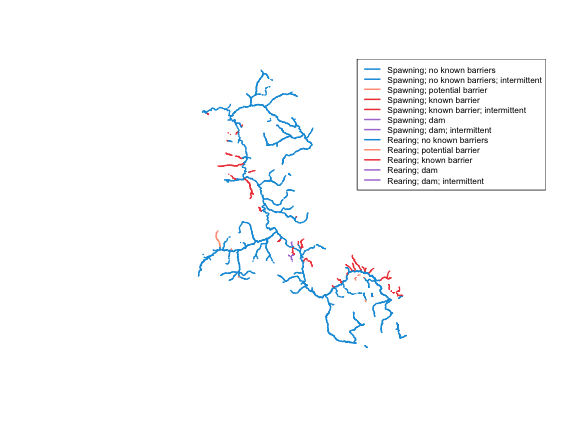

This vignette demonstrates `fresh` on a real watershed analysis task: extracting
the coho rearing/spawning stream network upstream of the Neexdzii Kwa (Upper
Bulkley River) / Wedzin Kwa confluence — the same scoping used in the
[restoration_wedzin_kwa_2024](https://github.com/NewGraphEnvironment/restoration_wedzin_kwa_2024)
land cover change analysis. Stream colours come from the
[gq](https://github.com/NewGraphEnvironment/gq) style registry.

## Snap the confluence

Start by snapping a point near the Neexdzii Kwa / Wedzin Kwa confluence to the
FWA stream network.


``` r
library(fresh)
library(sf)
#> Linking to GEOS 3.13.0, GDAL 3.8.5, PROJ 9.5.1; sf_use_s2() is TRUE

mouth <- frs_point_snap(x = -126.18, y = 54.39)
mouth[, c("gnis_name", "blue_line_key", "downstream_route_measure", "distance_to_stream")]
#> Simple feature collection with 1 feature and 4 fields
#> Geometry type: POINT
#> Dimension:     XY
#> Bounding box:  xmin: 988463 ymin: 1043062 xmax: 988463 ymax: 1043062
#> Projected CRS: NAD83 / BC Albers
#>   gnis_name blue_line_key downstream_route_measure distance_to_stream
#> 1      <NA>     360312275                 2137.031            154.857
#>                     geom
#> 1 POINT (988463 1043062)
```

In the real analysis, we use the known Bulkley mainstem position directly —
the same values used in `lulc_network-extract.R`.

## Coho rearing network

Query `bcfishpass.streams_co_vw` — the coho-specific habitat model view — for
streams with rearing or spawning habitat in the Bulkley watershed group. The
`table` parameter lets us target this view instead of the default
`bcfishpass.streams_vw`.


``` r
# Known Neexdzii Kwa / Wedzin Kwa confluence on Bulkley mainstem
blk <- 360873822
drm <- 166030.4

co_streams <- frs_fish_habitat(
  watershed_group_code = "BULK",
  table = "bcfishpass.streams_co_vw",
  cols = c("segmented_stream_id", "blue_line_key", "gnis_name",
           "stream_order", "channel_width", "mapping_code",
           "rearing", "spawning", "access", "geom")
)

# Filter to rearing/spawning habitat and order 4+
co_habitat <- co_streams[
  (co_streams$rearing > 0 | co_streams$spawning > 0) &
  co_streams$stream_order >= 4,
]

nrow(co_habitat)
#> [1] 3825
sort(unique(co_habitat$stream_order))
#> [1] 4 5 6 7 8
table(co_habitat$mapping_code)
#> 
#>               REAR;ASSESSED                    REAR;DAM 
#>                          43                           4 
#>       REAR;DAM;INTERMITTENT               REAR;MODELLED 
#>                           1                           9 
#>                   REAR;NONE              SPAWN;ASSESSED 
#>                         249                         369 
#> SPAWN;ASSESSED;INTERMITTENT                   SPAWN;DAM 
#>                           1                          13 
#>      SPAWN;DAM;INTERMITTENT              SPAWN;MODELLED 
#>                           3                          30 
#>                  SPAWN;NONE     SPAWN;NONE;INTERMITTENT 
#>                        3100                           3
```

## Style with gq

The [gq](https://github.com/NewGraphEnvironment/gq) package provides a
canonical style registry for bcfishpass layers. The `streams_salmon` layer
defines colours by `mapping_code` — the same codes used in the coho view.


``` r
reg <- gq::gq_reg_main()
cls <- gq::gq_tmap_classes(reg$layers$streams_salmon)

# mapping_code values and their colours from the registry
head(cls$values)
#>                  SPAWN;NONE     SPAWN;NONE;INTERMITTENT 
#>                   "#129bdb"                   "#129bdb" 
#>              SPAWN;MODELLED SPAWN;MODELLED;INTERMITTENT 
#>                   "#ff9f85"                   "#ff9f85" 
#>              SPAWN;ASSESSED SPAWN;ASSESSED;INTERMITTENT 
#>                   "#ef4545"                   "#ef4545"
```


``` r
# Match mapping_code to gq colours
co_habitat$col <- cls$values[co_habitat$mapping_code]
# Fallback for codes not in registry
co_habitat$col[is.na(co_habitat$col)] <- "#999999"

# Line width: spawning thicker than rearing (from gq convention)
co_habitat$lwd <- ifelse(co_habitat$spawning > 0, 1.7, 1.0)

plot(
  st_geometry(co_habitat),
  col = co_habitat$col,
  lwd = co_habitat$lwd,
  main = ""
)

# Legend from gq registry — show only codes present in the data
present <- names(cls$values) %in% unique(co_habitat$mapping_code)
legend(
  "topright",
  legend = cls$labels[present],
  col = cls$values[present],
  lwd = 2,
  cex = 0.7,
  bg = "white"
)
```



Named streams: Ailport Creek, Aitken Creek, Barren Creek, Blunt Creek, Boulder Creek, Buck Creek, Bulkley River, Byman Creek, Cabinet Creek, Canyon Creek, Causqua Creek, Cesford Creek, Coffin Creek, Corduroy Creek, Corya Creek, Crow Creek, Cumming Creek, Deep Creek, Denison Creek, Dockrill Creek, Driftwood Creek, Dungate Creek, Elliott Creek, Emerson Creek, Fifteen Mile Creek, Foxy Creek, Ganokwa Creek, Glacis Creek, Glass Creek, Goathorn Creek, Gramophone Creek, Harold Price Creek, Helps Creek, Howson Creek, Iltzul Creek, John Brown Creek, Johnny David Creek, Jonas Creek, Kathlyn Creek, Klo Creek, Lacroix Creek, Lemieux Creek, Luhk Creek, Luno Creek, Maish Creek, Maxan Creek, McKilligan Creek, McQuarrie Creek, Milk Creek, Morice River, Mudflat Creek, Natlan Creek, Netalzul Creek, Nine Mile Creek, North Ailport Creek, Perow Creek, Pine Creek, Porphyry Creek, Raspberry Creek, Reiseter Creek, Richfield Creek, Robert Hatch Creek, Robin Creek, Scallon Creek, Schippers Creek, Sinclair Creek, Skilokis Creek, Station Creek, Stock Creek, Sunsets Creek, Suskwa River, Telkwa River, Tenas Creek, Thompson Creek, Toboggan Creek, Touhy Creek, Trout Creek, Tsai Creek, Winfield Creek.

## Custom columns

All functions accept `table` and `cols` parameters so you can target any
schema/view and select only the columns you need:


``` r
habitat_slim <- frs_fish_habitat(
  watershed_group_code = "BULK",
  cols = c("blue_line_key", "gnis_name", "stream_order",
           "channel_width", "gradient", "geom"),
  limit = 20
)

names(habitat_slim)
#> [1] "blue_line_key" "gnis_name"     "stream_order"  "channel_width"
#> [5] "gradient"      "geom"
summary(habitat_slim$channel_width)
#>    Min. 1st Qu.  Median    Mean 3rd Qu.    Max.    NA's 
#>   0.660   1.280   1.660   7.257   4.140  47.990      11
```

## Compare with raw SQL

Without `fresh`, the coho habitat query requires connecting to the database,
writing SQL with schema-qualified table names, and managing the connection
lifecycle. `frs_fish_habitat()` wraps this in one call with flexible `table`
and `cols` parameters. For upstream network traversal with `fwa_upstream()`,
see `frs_network_prune()` — a single function call replacing ~20 lines of SQL.

## Summary

| Step | Function | What it does |
|------|----------|-------------|
| Snap | `frs_point_snap()` | Index a point to the nearest stream |
| Fetch | `frs_stream_fetch()`, `frs_lake_fetch()`, `frs_wetland_fetch()` | Retrieve FWA features |
| Traverse | `frs_network_upstream()`, `frs_network_downstream()` | Walk the network |
| Prune | `frs_network_prune()`, `frs_order_filter()` | Filter by order, gradient |
| Fish | `frs_fish_obs()`, `frs_fish_habitat()` | Observations and habitat model |

All functions accept `table` and `cols` parameters — swap the source table or
select only the columns you need.
