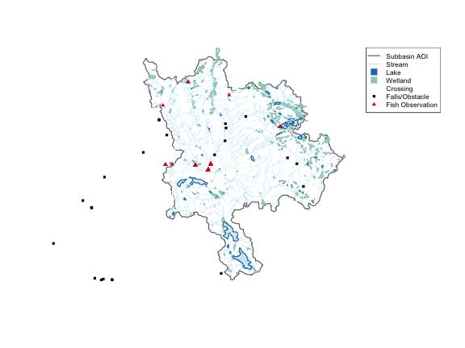

Network subtraction: query everything *between* two points on the same blue
line key — upstream of the downstream boundary minus upstream of the upstream
boundary. No spatial clipping needed.

Here we zoom into a subbasin of the Neexdzii Kwa (Upper Bulkley River) in the
traditional territory of the Wet'suwet'en, bounded by Byman Creek (downstream)
and Ailport Creek (upstream). We pull streams, lakes, wetlands, crossings, fish
observations, and falls in a single `frs_network()` call.


``` r
library(fresh)
library(sf)
#> Linking to GEOS 3.13.0, GDAL 3.8.5, PROJ 9.5.1; sf_use_s2() is TRUE

blk <- 360873822
drm_byman <- 208877     # just upstream of Byman Creek
drm_ailport <- 233564   # just upstream of Ailport Creek

# Subbasin polygon (downstream watershed minus upstream watershed)
ws_down <- frs_db_query(sprintf(
  "SELECT ST_Union(geom) as geom
   FROM whse_basemapping.fwa_watershedatmeasure(%s, %s)", blk, drm_byman
))
ws_up <- frs_db_query(sprintf(
  "SELECT ST_Union(geom) as geom
   FROM whse_basemapping.fwa_watershedatmeasure(%s, %s)", blk, drm_ailport
))
aoi <- st_difference(ws_down, ws_up)

# All tables between the two points
result <- frs_network(blk, drm_byman, upstream_measure = drm_ailport,
  tables = list(
    streams = "whse_basemapping.fwa_stream_networks_sp",
    lakes = "whse_basemapping.fwa_lakes_poly",
    wetlands = "whse_basemapping.fwa_wetlands_poly",
    crossings = "bcfishpass.crossings",
    fish_obs = "bcfishobs.fiss_fish_obsrvtn_events_vw",
    falls = "bcfishpass.falls_vw"
  )
)
```

2167 stream segments, 89 lakes,
323 wetlands, 526 crossings,
72 fish observations, and 98 falls
— all from network subtraction, no spatial clip.


``` r
reg <- gq::gq_reg_main()
lake_style <- gq::gq_tmap_style(reg$layers$lake)
wetland_style <- gq::gq_tmap_style(reg$layers$wetland)
obs_style <- reg$layers$bcfishobs_fiss_fish_observations$mark
obstacle_style <- reg$layers$fiss_obstacles$mark
crossing_style <- reg$layers$crossings_modelled$mark

# Base: AOI + wetlands + lakes + streams
plot(st_geometry(aoi), col = NA, border = "grey40", lwd = 1.5, main = "")
if (nrow(result$wetlands) > 0) {
  plot(st_geometry(result$wetlands), col = wetland_style$fill,
       border = wetland_style$fill, add = TRUE)
}
if (nrow(result$lakes) > 0) {
  plot(st_geometry(result$lakes), col = lake_style$fill,
       border = lake_style$col, add = TRUE)
}
plot(st_geometry(result$streams), col = "#a9e0ff", lwd = 0.3, add = TRUE)

# Points: crossings, fish obs, falls
if (nrow(result$crossings) > 0) {
  plot(st_geometry(result$crossings), pch = 1, cex = 0.5,
       col = crossing_style$color, add = TRUE)
}
if (nrow(result$falls) > 0) {
  plot(st_geometry(result$falls), pch = 15, cex = 0.6,
       col = obstacle_style$color, add = TRUE)
}
if (nrow(result$fish_obs) > 0) {
  plot(st_geometry(result$fish_obs), pch = 17, cex = 0.7,
       col = obs_style$color, add = TRUE)
}

legend(
  "topright",
  legend = c("Subbasin AOI", "Stream", "Lake", "Wetland",
             "Crossing", "Falls/Obstacle", "Fish Observation"),
  col = c("grey40", "#a9e0ff", lake_style$col, wetland_style$fill,
          crossing_style$color, obstacle_style$color, obs_style$color),
  pch = c(NA, NA, 15, 15, 1, 15, 17),
  lwd = c(1.5, 0.8, NA, NA, NA, NA, NA),
  pt.cex = c(NA, NA, 1.5, 1.5, 0.5, 0.6, 0.7),
  cex = 0.7, bg = "white"
)
```


